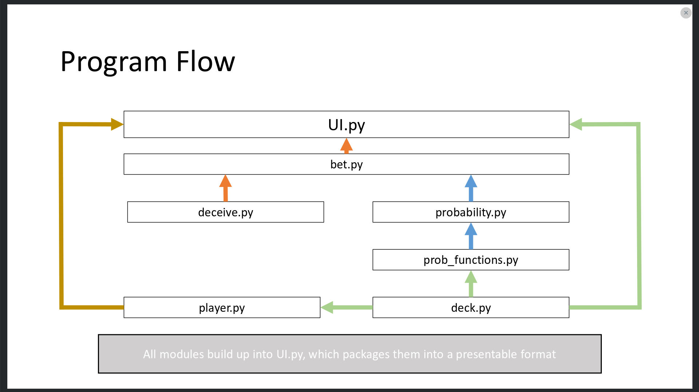

# Poker
A game of poker against AI utilizing the Kelly Criterion for betting

## Rundown of Programs

### bet.py
Calculates how much the computer should bet and betting logic

### deceive.py 
Calculates when/if the computer should mislead the opponent

### deck.py
Contains the deck class
contains functions pertaining to the deck
Contains card class

### player.py
Represents player properties and functions with name, current cash, and current hand

### probability.py
Calculates probability of winning a hand
Uses Monte-Carlo methods and CPU parallelization to speed up calculation

The function single\_prob uses the Monte-Carlo method, while calculate\_prob uses multithreading.

### prob_functions.py
Supports probability.py

### UI
Packages everything into presentable format

## Dependencies
I use the dill package and the multiprocess package for python3 from pathos.

I installed using pip.

## Program Flow

